# Architecture Diagrams

This document contains detailed architecture diagrams for the Universal Agent Protocol proposal.

## System Overview

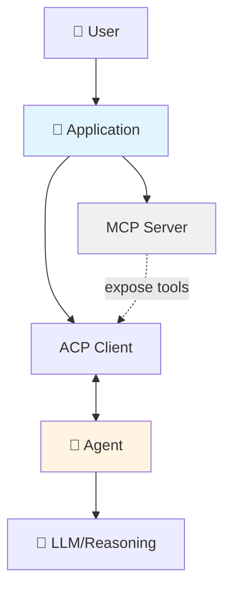

## Protocol Stack

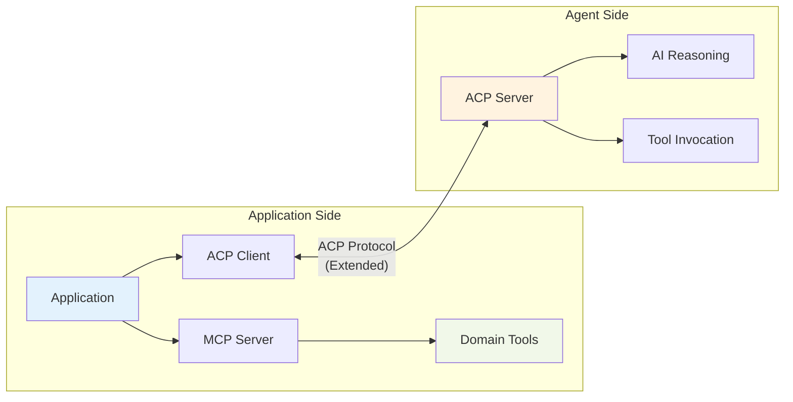

## Communication Flow

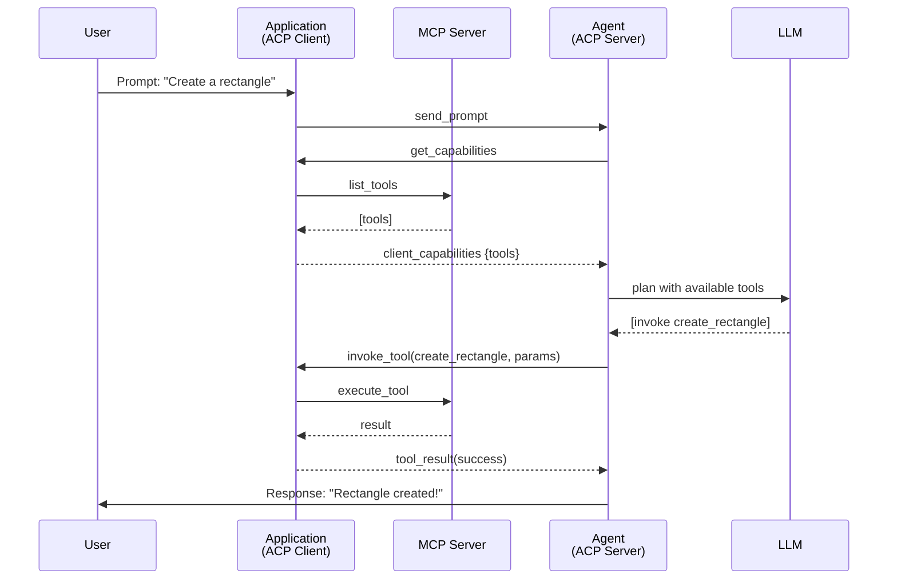

## Tool Discovery Flow

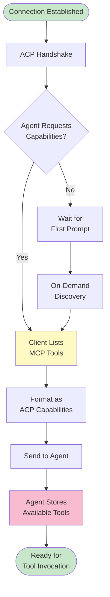

## Tool Invocation Flow

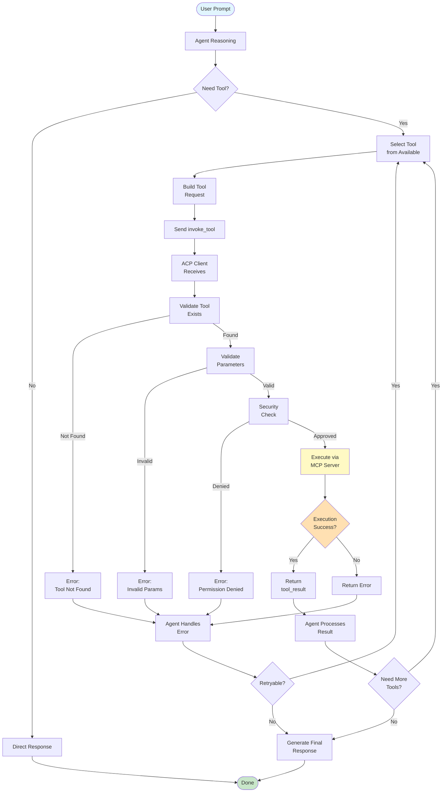

## Integration Patterns

### Pattern 1: Embedded MCP Server

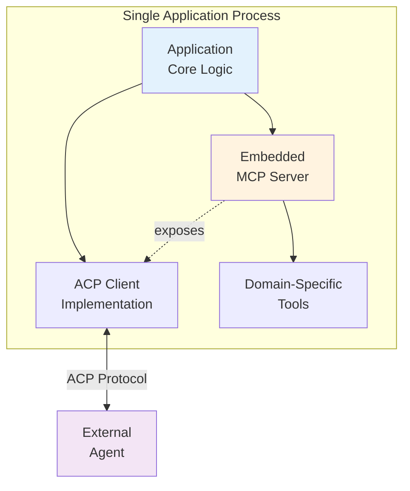

### Pattern 2: External MCP Servers

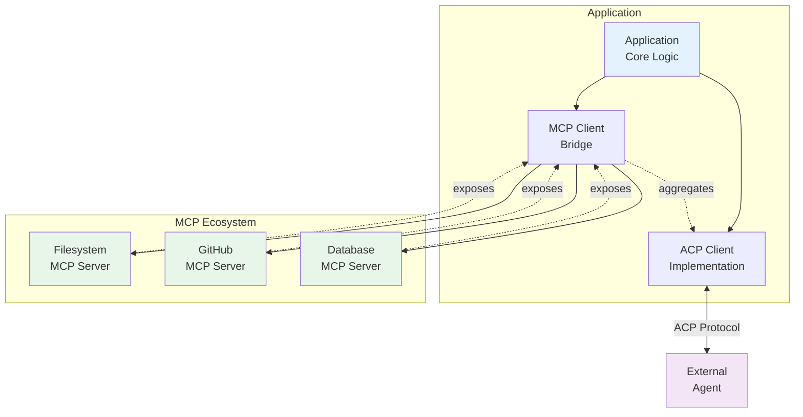

### Pattern 3: Hybrid

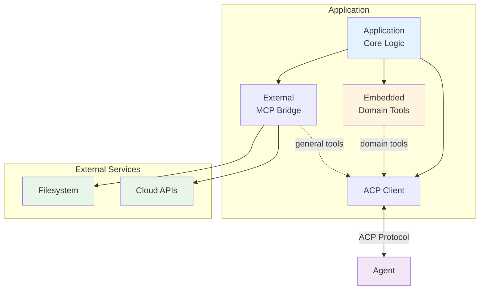

## Comparison: ACP vs ACP+MCP vs AG-UI

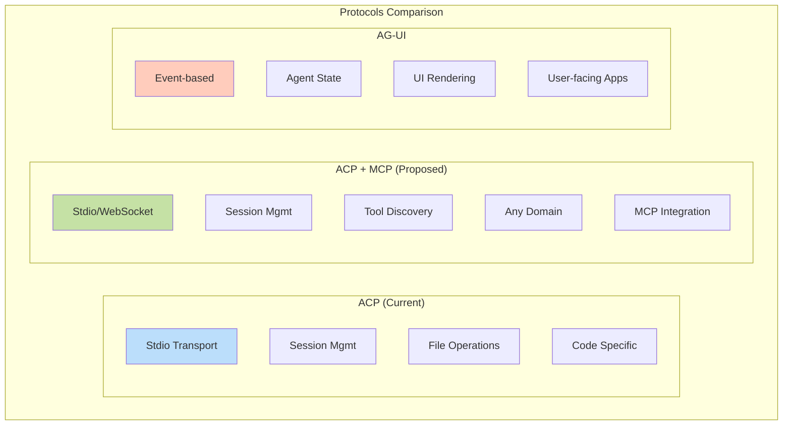

## Complete System Architecture

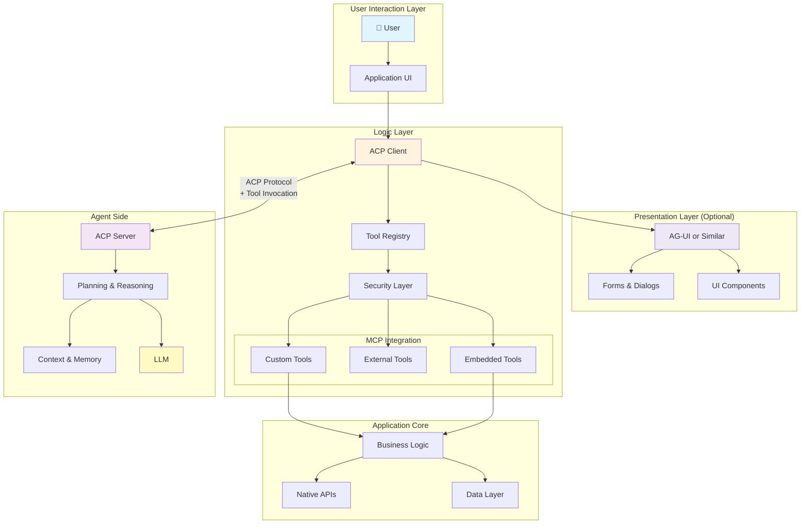

## Data Flow: End-to-End

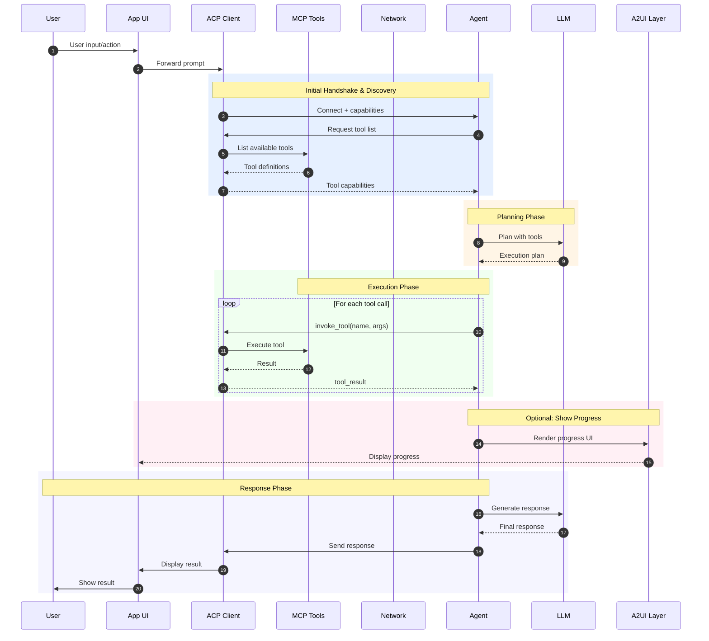

## Security & Approval Flow

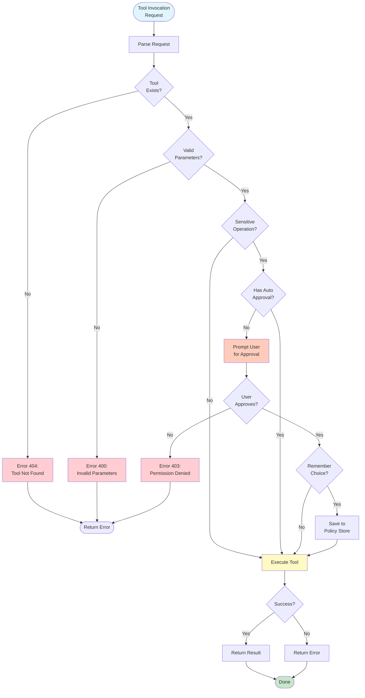

---

## ASCII Diagrams (for Markdown compatibility)

### System Overview (ASCII)

```
┌─────────────────────────────────────────────────┐
│  APPLICATION (Client)                           │
│                                                  │
│  ┌───────────────────────────────────────────┐ │
│  │ ACP Client Implementation                  │ │
│  │  • Bidirectional communication            │ │
│  │  • Session management                     │ │
│  │  • Tool capability advertising            │ │
│  └───────────────┬───────────────────────────┘ │
│                  │                               │
│  ┌───────────────▼───────────────────────────┐ │
│  │ MCP Server(s)                              │ │
│  │  • Tool definitions                       │ │
│  │  • Tool execution                         │ │
│  │  • Domain-specific logic                  │ │
│  └───────────────────────────────────────────┘ │
└─────────────────────────────────────────────────┘
                   ↕
          ┌────────┴────────┐
          │   ACP Protocol   │
          │   (Extended)     │
          │                  │
          │ • Prompts        │
          │ • Responses      │
          │ • Tool discovery │
          │ • Tool invocation│
          └────────┬─────────┘
                   ↕
┌─────────────────────────────────────────────────┐
│  AGENT (Server)                                  │
│                                                  │
│  ┌───────────────────────────────────────────┐ │
│  │ ACP Server Implementation                  │ │
│  │  • Prompt handling                        │ │
│  │  • Tool discovery                         │ │
│  │  • Tool invocation                        │ │
│  └───────────────┬───────────────────────────┘ │
│                  │                               │
│  ┌───────────────▼───────────────────────────┐ │
│  │ AI Reasoning Engine                        │ │
│  │  • LLM integration                        │ │
│  │  • Planning & orchestration               │ │
│  │  • Response generation                    │ │
│  └───────────────────────────────────────────┘ │
└─────────────────────────────────────────────────┘
```

### Communication Flow (ASCII)

```
User                App (ACP)        MCP Server       Agent           LLM
 │                     │                  │              │              │
 ├─ Prompt ───────────>│                  │              │              │
 │                     ├─ Forward ───────>│              │              │
 │                     │<─ Tools ─────────┤              │              │
 │                     ├─ Capabilities ──────────────────>│              │
 │                     │                  │              ├─ Plan ───────>│
 │                     │                  │              │<─ Actions ────┤
 │                     │<─ invoke_tool ──────────────────┤              │
 │                     ├─ Execute ───────>│              │              │
 │                     │<─ Result ────────┤              │              │
 │                     ├─ tool_result ───────────────────>│              │
 │                     │                  │              ├─ Finalize ───>│
 │                     │                  │              │<─ Response ───┤
 │<─ Response ─────────┼──────────────────────────────────┤              │
 │                     │                  │              │              │
```

### Protocol Stack (ASCII)

```
┌────────────────────────────────────────────────────┐
│                                                     │
│         PRESENTATION LAYER (Optional)              │
│         ┌──────────────────────────┐              │
│         │    A2UI Protocol         │              │
│         │  • Declarative UI        │              │
│         │  • Component rendering   │              │
│         │  • Visual feedback       │              │
│         └──────────────────────────┘              │
│                                                     │
├─────────────────────────────────────────────────────┤
│                                                     │
│         LOGIC LAYER                                │
│         ┌──────────────────────────┐              │
│         │  ACP + MCP Integration   │              │
│         │  • Tool discovery        │              │
│         │  • Tool invocation       │              │
│         │  • Context passing       │              │
│         └──────────────────────────┘              │
│                                                     │
├─────────────────────────────────────────────────────┤
│                                                     │
│         APPLICATION LAYER                          │
│         ┌──────────────────────────┐              │
│         │  Domain-Specific Logic   │              │
│         │  • Business rules        │              │
│         │  • Data access           │              │
│         │  • Native capabilities   │              │
│         └──────────────────────────┘              │
│                                                     │
└────────────────────────────────────────────────────┘
```

---

**Note:** For best viewing of Mermaid diagrams, use GitHub's native markdown renderer or any Mermaid-compatible viewer.
